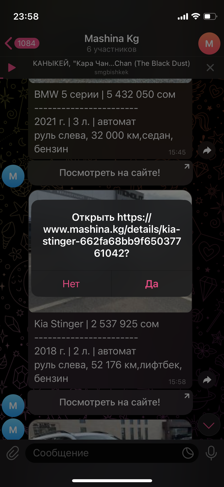

# Mashina Parsing

Mashina Parsing is a Python-based project designed to scrape car listings from **[mashina.kg](https://mashina.kg)** and send notifications through a Telegram bot. It aims to help users track new listings based on specific search criteria like price, make, model, and other parameters. The bot sends car listing photos and details directly to your Telegram chat.

## Table of Contents

- [Project Overview](#project-overview)
- [Installation](#installation)
- [Configuration](#configuration)
- [Building the Project](#building-the-project)
- [Usage](#usage)
- [Gallery](#gallery)

## Project Overview

This project is not created with the intention of offending, harming, or disrupting the business of others. It is designed to help users track car listings efficiently by automating the process of scraping and sending relevant car information through Telegram.

## Installation

### Prerequisites

Before you begin, ensure that you have the following installed:

- **Python 3.11** or newer
- **pip** for package management

### Setup

1. **Clone the repository:**

    ```bash
    git clone https://github.com/yourusername/yourproject.git
    cd yourproject
    ```

2. **Create a virtual environment:**

    ```bash
    python3 -m venv venv
    ```

3. **Activate the virtual environment:**

    - For **Windows**:

        ```bash
        .\venv\Scripts\activate
        ```

    - For **Unix** or **MacOS**:

        ```bash
        source venv/bin/activate
        ```

4. **Install dependencies:**

    ```bash
    pip install -r requirements.txt
    ```

5. **Run the project:**

    ```bash
    python main.py
    ```

## Configuration

To connect your bot and set up the scraping parameters, open the `main.py` file and update the following fields in the `MashinaAPI` class:

```python
class MashinaAPI:
    EVERY = 1  # Set to 1 for periodic checks
    CHAT_ID = "your_chat_id"  # Your Telegram chat ID
    BOT_TOKEN = "your_bot_token"  # Your Telegram bot token
    TELEGRAM_PATH = f"https://api.telegram.org/%s/sendPhoto" % BOT_TOKEN
    BASE_API = ("https://www.mashina.kg/search/all/all/?currency=1&price_from=10000&price_to=260000&sort_by=upped_at"
                "+desc&time_created=1&page=1")  # Set your search query parameters here
```

- **CHAT_ID**: Get your Telegram chat ID by messaging your bot.
- **BOT_TOKEN**: Get your Telegram bot token by creating a bot on [BotFather](https://core.telegram.org/bots#botfather).
- **BASE_API**: Adjust the URL to reflect the search parameters that best suit your needs.

## Building the Project

To create a standalone executable from the Python script, you can use **PyInstaller**. Here's how:

1. **Install PyInstaller:**

    ```bash
    pip install pyinstaller
    ```

2. **Build the executable:**

    ```bash
    pyinstaller --onefile main.py
    ```

3. **Running the executable:**

    - For **Windows**:
  
        ```bash
        ./dist/main.exe
        ```

    - For **Unix** or **MacOS**:

        ```bash
        ./dist/main
        ```

## Usage

Once the project is set up and running, the bot will scrape **mashina.kg** for car listings that match your specified parameters. The bot will send the car details and images to your Telegram chat.

You can modify the search query in `BASE_API` to filter cars based on various parameters such as price, make, model, and location.

## Example Group

Below are some screenshots of the project in action:



_Example of the bot sending car listing photos to Telegram._
---

You can replace the placeholder URLs (like `https://via.placeholder.com/500x300.png?text=Telegram+Bot+Screenshot+1`) with actual images when you're ready to showcase your project. Let me know if you need further modifications!